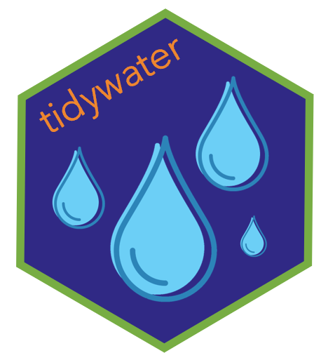

<!-- README.md is generated from README.Rmd. Please edit that file -->

# tidywater 

<!-- badges: start -->

[](https://github.com/BrownandCaldwell-Public/tidywater/actions/workflows/R-CMD-check.yaml)
<!-- badges: end -->

## Overview

Tidywater incorporates published water chemistry and empirical models in
a standard format. The modular functions allow for building custom,
comprehensive drinking water treatment processes. Functions are designed
to work in a [tidyverse](https://www.tidyverse.org/) workflow.

## Installation

``` r
# Install tidywater from CRAN:
install.packages("tidywater")

# Alternatively, install the development version from GitHub:
# install.packages("devtools")
devtools::install_github("BrownandCaldwell-Public/tidywater")
```

## Examples

In this first example, acid-base chemistry and TOC removal models are
demonstrated. This example uses tidywater base functions to model a
single water quality scenario.

``` r
library(tidywater)
library(tidyverse)
## Use base tidywater functions to model water quality for a single scenario.
base_coagulation <- define_water(ph = 8, alk = 90, tds = 50, toc = 3, doc = 2.8, uv254 = 0.08) %>%
  chemdose_ph(alum = 30) %>%
  chemdose_toc(alum = 30)
```

To model multiple water quality scenarios, use tidywater’s helper
functions (x_chain or x_once) to apply the models to a dataframe.

``` r
## x_chain functions apply models to a list of "waters", and output a list of "waters" so that
## the data can be piped into the next tidywater model.
coagulation <- water_df %>%
  define_water_chain() %>%
  mutate(alum = 30) %>%
  chemdose_ph_chain() %>%
  chemdose_toc_chain()

## x_once functions apply models to a list of "waters", but output a data frame. The data can not be
## piped to a downstream tidywater function, but all the "water" parameters are now visible and
## can be manipulated as a typical data frame.

enhanced_coagulation <- water_df %>%
  define_water_chain() %>%
  mutate(alum = seq(1, 12, 1)) %>%
  chemdose_ph_once(hcl = 10)
```

Note that these functions use a “water” class. The “water” class is the
foundation of the package; it provides a mechanism for linking models in
any order while maintaining water quality information. The
`define_water` function takes water quality inputs, but
`define_water_chain` may be used to convert a dataframe to a list of
“waters”.

For more detailed examples on tidywater functions and how to use “water”
class data, please see the tidywater vignettes:
`browseVignettes("tidywater")`
